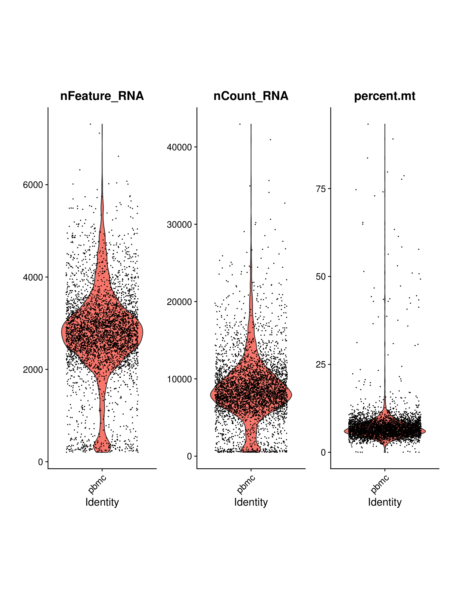
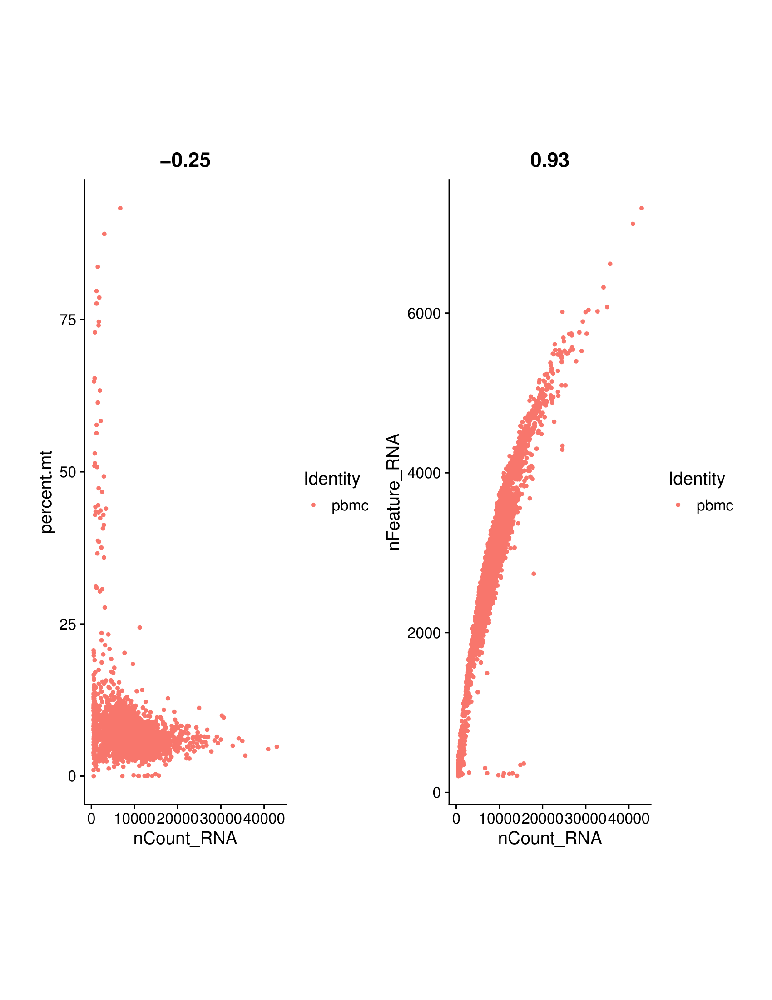

# scRNA_Seq_Analysis
scRNA-Seq Analysis of 10X 3' Universal PBMC Data

# Seurat Analysis in R

Load packages, import data, create Seurat object

```
library(dplyr)
library(Seurat)
library(patchwork)
library(celldex)
library(SingleR)
library(ensembldb)
library(scrapper)

setwd("//austin/pbmc/")

pbcm.data <- Read10X(data.dir = "runs/pbmc_slurm_test/outs/filtered_feature_bc_matrix/")

pbmc <- CreateSeuratObject(counts = pbcm.data, project = "pbmc",
                           min.cells = 3, min.features = 200)
```

Format Data, visualize QC metrics
```
# The [[ operator can add columns to object metadata. This is a great place to stash QC stats
pbmc[["percent.mt"]] <- PercentageFeatureSet(pbmc, pattern = "^MT-")

# Visualize QC metrics as a violin plot
pdf(file = "figs/QC_Violin_Plot.pdf",
    width = 12, height = 8, paper = "letter")
VlnPlot(pbmc, features = c("nFeature_RNA", "nCount_RNA", "percent.mt"), ncol = 3)
dev.off()
```


# Scatter plots of feature X feature relationships, this includes percent MT dDNA, Feature RNA and counts

```
# FeatureScatter is typically used to visualize feature-feature relationships, but can be used
# for anything calculated by the object, i.e. columns in object metadata, PC scores etc.

plot1 <- FeatureScatter(pbmc, feature1 = "nCount_RNA", feature2 = "percent.mt")
plot2 <- FeatureScatter(pbmc, feature1 = "nCount_RNA", feature2 = "nFeature_RNA")
plot <- plot1 + plot2
pdf(file = "figs/feature_feature_correlations.pdf",
    width = 12, height = 8, paper = "letter")
plot
dev.off()

rm(plot, plot1, plot2)
```



# I had to increase the number of cells from the original nFeature_RNA < 2500
# I increased the nFeature_RNA to < 4000

pbmc <- subset(pbmc, subset = nFeature_RNA > 200 & nFeature_RNA < 3500 & percent.mt < 5)

# normalize data
pbmc <- NormalizeData(pbmc, normalization.method = "LogNormalize", scale.factor = 10000)

# Identification of highly variable features
pbmc <- FindVariableFeatures(pbmc, selection.method = "vst", nfeatures = 2000)

# Identify the 10 most highly variable genes
top10 <- head(VariableFeatures(pbmc), 10)

# plot variable features with and without labels
plot1 <- VariableFeaturePlot(pbmc)
plot2 <- LabelPoints(plot = plot1, points = top10, repel = TRUE)
plot <- plot1 + plot2
pdf(file = "figs/plot_variable_features.pdf",
    width = 12, height = 10, paper = "letter")
plot2
dev.off()
rm(plot1, plot2, plot)

# scale data

all.genes <- rownames(pbmc)
pbmc <- ScaleData(pbmc, features = all.genes)

# linear dimensionality reduction
pbmc <- RunPCA(pbmc, features = VariableFeatures(object = pbmc))

# Examine and visualize PCA results a few different ways
print(pbmc[["pca"]], dims = 1:5, nfeatures = 5)

pdf(file = "figs/visualize_dim_loadings.pdf",
    width = 8, height = 12, paper = "letter")
VizDimLoadings(pbmc, dims = 1:2, reduction = "pca")
dev.off()

pdf(file = "figs/PCA_Fig_5.pdf",
    width = 12, height = 8, paper = "letter")
DimPlot(pbmc, reduction = "pca") + NoLegend()
dev.off()

pdf(file = "figs/PC_1_Heatmap_fig_6.pdf",
    width = 12, height = 10, paper = "letter")
DimHeatmap(pbmc, dims = 1, cells = 1000, balanced = TRUE)
dev.off()

pdf(file = "figs/all_PC_Heatmaps_fig_7.pdf",
    width = 10, height = 20, paper = "letter")
DimHeatmap(pbmc, dims = 1:15, cells = 500, balanced = TRUE)
dev.off()

pdf(file = "figs/elbow_plot_fig_8.pdf",
    width = 12, height = 10, paper = "letter")
ElbowPlot(pbmc)
dev.off()

# Cell clustering

pbmc <- FindNeighbors(pbmc, dims = 1:10)
pbmc <- FindClusters(pbmc, resolution = 0.5)

# Look at cluster IDs of the first 5 cells
head(Idents(pbmc), 5)

pbmc <- RunUMAP(pbmc, dims = 1:10)

# note that you can set `label = TRUE` or use the LabelClusters function to help label
# individual clusters
pdf(file = "figs/UMAP_Fig_9.pdf",
    width = 10, height = 10, paper = "letter")
DimPlot(pbmc, reduction = "umap")
dev.off()


# Now we can investigate DEG for biomarker discovery

# find all markers of cluster 2
cluster2.markers <- FindMarkers(pbmc, ident.1 = 2)
head(cluster2.markers, n = 5)

# find markers for every cluster compared to all remaining cells, report only the positive
# ones
pbmc.markers <- FindAllMarkers(pbmc, only.pos = TRUE)
pbmc.markers %>%
  group_by(cluster) %>%
  dplyr::filter(avg_log2FC > 1)

cluster0.markers <- FindMarkers(pbmc, ident.1 = 0, logfc.threshold = 0.25, 
                                test.use = "roc", only.pos = TRUE)
head(cluster0.markers, n = 30)
# LEF1 and PRKCA were two markers produced from this analysis
# plot as violins, exp by cluster

pdf(file = "figs/LEF1_PRKCA_Cluster_Expression_Violin_Plot_Fig_10.pdf",
    width = 12, height = 10, paper = "letter")
VlnPlot(pbmc, features = c("LEF1", "PRKCA"))
dev.off()


pdf(file = "figs/gene_by_UMAP_Fig_11.pdf",
    width = 12, height = 10, paper = "letter")
FeaturePlot(pbmc, features = c("LEF1", "TGFBR2", "NDFIP1", "PRKCA", "TCF7", "RAPGEF6", "TXK", "GAS5",
                               "FHIT"))
dev.off()

pbmc.markers %>%
  group_by(cluster) %>%
  dplyr::filter(avg_log2FC > 1) %>%
  slice_head(n = 10) %>%
  ungroup() -> top10
pdf(file = "figs/top_pbmc_markers_fig_12.pdf",
    width = 12, height = 10, paper = "letter")
DoHeatmap(pbmc, features = top10$gene)
dev.off()


### perform cell and cluster type annotation using cellDex + SingleR

norm_exp_mat <- Seurat::GetAssayData(
  object = pbmc,
  assay = "RNA",
  layer = "data"
)

dim(norm_exp_mat)

hpca <- HumanPrimaryCellAtlasData(ensembl=FALSE)


ann_norm_exp_mat <- SingleR(norm_exp_mat, ref=hpca, labels=hpca$label.fine,
                            de.method = "classic",
                            assay.type.test= "logcounts",
                            assay.type.ref = "logcounts",
                            BPPARAM = BiocParallel::SerialParam())
length(unique(ann_norm_exp_mat$labels))
summary(is.na(ann_norm_exp_mat$pruned.labels))


pdf(file = "figs/cell_anno_score_heatmap.pdf",
    width = 12, height = 10, paper = "letter")
SingleR::plotScoreHeatmap(ann_norm_exp_mat)
dev.off()

pbmc$singler_cells_labels = ann_norm_exp_mat$labels

seeable_palette = setNames(
  c(RColorBrewer::brewer.pal(name = "Dark2", n = 8),
    c(1:(length(unique(ann_norm_exp_mat$labels)) - 8))),
  nm = names(sort(table(ann_norm_exp_mat$labels), decreasing = TRUE)))

# UMAP with the predicted annotation by cell
ann_plot <- DimPlot(
  object = pbmc, 
  reduction = "umap", 
  group.by = "singler_cells_labels", #we want to color cells by their annotation 
  pt.size = 2,
  cols = seeable_palette
) + ggplot2::theme(legend.position = "bottom")

pdf(file = "figs/Ann_Cell_Plot_Fig13.pdf",
    width = 12, height = 10, paper = "letter")
ann_plot
dev.off()
# UMAP with the cluster numbers (before annotation)


# Run cell annotation at the cluster level

pop_by_cluster = prop.table(table(pbmc$singler_cells_labels,
                                  pbmc$RNA_snn_res.0.5),
                            margin = 2)
colSums(pop_by_cluster > 0.3)

# Rerun singleR annotation at cluster level
clust_ann_predictions <- SingleR(
  norm_exp_mat,
  clusters = pbmc$RNA_snn_res.0.5,
  ref = hpca,
  labels = hpca$label.fine,
  assay.type.test = "logcounts",
  assay.type.ref = "logcounts",
  BPPARAM = BiocParallel::SerialParam()
)

pdf(file = "figs/cluster_cell_anno_score_heatmap.pdf",
    width = 12, height = 10, paper = "letter")
SingleR::plotScoreHeatmap(clust_ann_predictions)
dev.off()
# Save the name of future annotation
clust_labels_col = "singler_clust_labels"
# Create a column with this name in the metadata and fill it with the cluster levels of each cell
pbmc@meta.data[[clust_labels_col]] = pbmc@meta.data$RNA_snn_res.0.5
# Fill associate each cluster with its annotation 
levels(pbmc@meta.data[[clust_labels_col]]) = clust_ann_predictions$labels

ann_cluster_plot <- DimPlot(
  object = pbmc, 
  reduction = "umap", 
  group.by = clust_labels_col,
  pt.size = 2,
  label = FALSE, 
  cols = seeable_palette
) + ggplot2::theme(legend.position = "bottom")

pdf(file = "figs/Ann_Cluster_plot_Fig13.pdf",
    width = 12, height = 10, paper = "letter")
ann_cluster_plot
dev.off()
